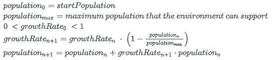

# JavaRecursion

Java Test Driven Development (TDD) project to exercise Java Recursion with unit testing ( with **JUnit** )

  
Source

 <em>derived from CISC191Recursion</em> 
 

# San Diego Mesa College CISC 191 Programming Challenges
Programming challenges for San Diego Community College CISC 191 Intermediate Java classes.

Created by
- Professor Dr. Tasha Frankie
- and Professor [Allan Schougaard](https://github.com/schougaard), San Diego Mesa College.

With contributions from: 
- Dom David,
- [Dan Sullivan](https://github.com/uid100)

 
Assignment Overview

Write programs that use  recursion.

implement two growth models:

Compound interest
Logistic growth

implement two growth models:

 - Compound interest
 - Logistic growth

Compound interest is the the way that interest is calculated on bank accounts and loans. It is technically defined as:
> "Compound interest is the addition of interest to the principal sum of a loan or deposit, or in other words, interest on interest. It is the result of reinvesting interest, rather than paying it out, so that interest in the next period is then earned on the principal sum plus previously accumulated interest. " [Wikipedia: Compound interestLinks to an external site.](https://en.wikipedia.org/wiki/Compound_interest)

For these challenges assume that interest is added once a year. The formulas that we are going to use are:

     

The _interestRate_ is the rate at which money is added to the balance each year. For instance, the US stock market has an average effective interest rate of 7% per year since 1950, while the actual interest rate on a saving account in a bank currently is around 0.03%.

Logistic growth is a model for population growth which takes into account the size of the population and the resources available to the population. For instance, when a population of bacteria grows, they eat of the nutrients in the environment, and when there is not enough nutrients bacteria diminish. [Mathispower4u: Logistic Growth: Using Recursive Equations](https://www.youtube.com/watch?v=E2REyozXL3Y) and [Khan Academy: Exponential & logistic growth](https://www.khanacademy.org/science/ap-biology/ecology-ap/population-ecology-ap/a/exponential-logistic-growth)

The formulas that we are going to use are:

     

The _growthRate_ is similar to the interest rate above. It can start at any number between 0 and 1. 

Note: populations are whole numbers (so which data type would be correct to use?), and that the growth rate changes over time (unlike compound interest).

   

 
Instructions

    
1. From the <> Code dropdown link in the repository (above), download the Zip file to your computer.
2. Extract the files to your working folder
3. Open Eclipse and import the project.
   - You can use File>Import menu item or right-click in the Package Manager and choose Import.
   - Select General>Projects from Folder or Archive
   - Navigate into the project until you see the `bin` and `src` folders, and choose _open_
4. Expand the project in the package explorer and find the `.java` files below the `src` folder.
5. Open CISC191Recursion -> src -> TestRecursion.java
6. In the main menu, select Run -> Run
   - Observe that the first test ran but did not pass.
   - Open CISC191Recursion-> src -> Recursion.java and change the calculateEndBalance method to work correctly.
   - When you think you have it, go back to TestRecursion.java and run the tests again.
   - When you have method working correctly - the test passes, uncomment the next test method and continue to implement the needed method.
7. When you get to the testTree test, you will need to actually write the code to implement a tree.
   - This code should be written in NameNode.java (started code is provided for you).
   - Write the constructor and the toString methods first.
   - The toString method should be implemented recursively. Start with an empty String. Then, look at the left node of the tree; if it's null, there's nothing to append to the String, but if it's not null, then the code should recursively append the left node's toString. Then, the node should append its own name, and finally, the right node should be printed recursively.
   - Write the insert method last. If the parameter is alphabetically before the current node's String, it will go in the left branch. To figure out where in the left branch, recursively try to place the newName on the left node. The base case here is when the left node is null, assign to the left node a new node containing the parameter value. On the other hand, if the parameter is alphabetically after the current node's String, then recursively add it to the right node. The base case is similar to assigning to the left node. Finally, if the parameter is equal to the current node's String, then do nothing because the name is already in the tree.
   - You may find it helpful to read about binary treesLinks to an external site. but note that the linked page does not implement insert recursively.
   
   The challenge is complete when you have all tests succeeding.

 
Submission

## Complete and zip the project
1. Run and add the code to the src folder until the tests are successful.
2. Uncomment each test case in the **Test** file, one at a time. 
Do not modify the content in this file except to uncomment the tests. Add and modify class files
as needed for the tests to pass.
3. Review and refactor any of the code as needed:
    - be sure your code follows good coding practices and coding style and standards.
    - update the javadoc comments at the top of the file to add your name as author
    - update the comments for each method in the file.
4. Export the project as a zip file and submit your work.
   _Note: You are turning in the Eclipse project so that I can easily open it and run it on my computer._

 
Rubric

[Rubric](Rubric.md)

___________

_this repository is a subset of the CISC191 exercises. It is derived from the CISC191ProgrammingChallenges 
activity hosted by Professor Allan Schougaard, San Diego Mesa College, and not a direct fork._

_This project is to decompose that repository into git submodules_
